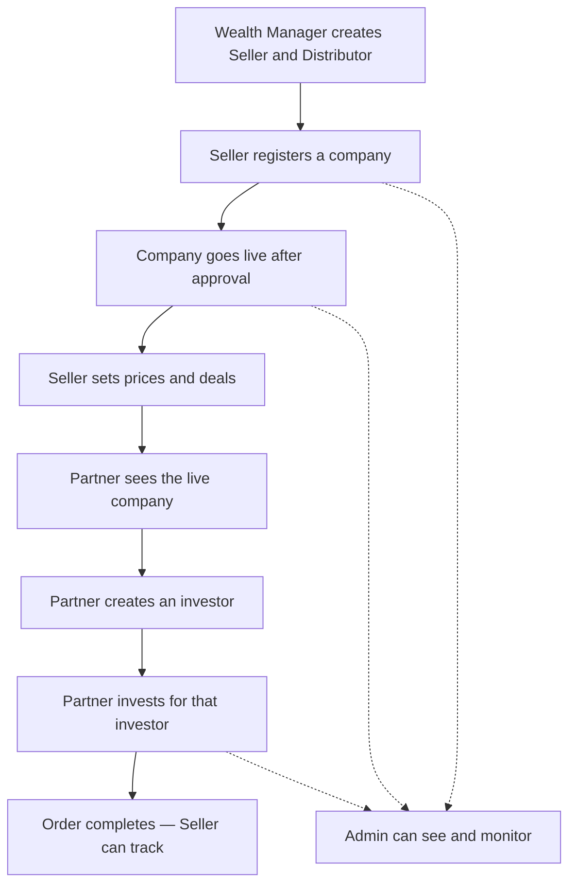

# Whole project flow — Partner marketplace

**Who this is for:** stakeholders, product, and business teams.  
**In one sentence:** A Seller adds a company; after it goes live, a Partner creates an investor and invests for them; the Seller tracks the order to completion.

> **Target model (docs):** Seller is a **partner role** on the partner network. Wealth Manager can create **Seller** and **Distributor**.  
> **Code later:** Today some seller features still use a separate seller account — this document describes the **intended** product flow.

---

## Big picture

**Admin note:** Admin can **see** pending companies, live companies, and orders. This story is driven by **Seller** and **Partner**, not by admin day-to-day work.

**Investor note:** In this product path, **only the Partner creates the investor** and places the investment for them.

---

## Steps at a glance

| Step | What happens | Result | Detail |
|------|--------------|--------|--------|
| 1 | Wealth Manager creates Seller (and can create Distributor) | Seller account exists in the partner network | [Flow A](flows/wm-create-seller-distributor.md) |
| 2 | Seller registers a company | Company is **pending** (not live yet) | [Flow B](flows/seller-register-company.md) |
| 3 | Company is approved | Company **goes live** — partners can see it | [Flow C](flows/company-goes-live.md) |
| 4 | Seller sets prices and/or deals | Inventory is ready for partners | [Flow D](flows/seller-prices-and-deals.md) |
| 5 | Partner browses live companies (optional enquiry) | Partner knows what to offer | [Flow E](flows/partner-discovers-company.md) |
| 6 | Partner creates an investor | Investor belongs to that partner | [Flow F](flows/partner-create-investor.md) |
| 7 | Partner invests for that investor | Investment order is placed | [Flow G](flows/partner-invest-for-investor.md) |
| 8 | Order moves through confirmation to complete | Deal finished; seller can track progress | [Flow H](flows/order-to-complete.md) |

---

## How to use this with stakeholders

1. Show this page and the flowchart first (2–3 minutes).  
2. Click any step in the table for a deeper walkthrough.  
3. For roles (“who is who”), open the [Actors hub](../actors/README.md).

---

## Related

- [Actors hub](../actors/README.md) — roles in plain language  
- [Partner module](../modules/partner-business.md) — partner types and capabilities  
- [Partner database](../database/partner.md) — how roles connect in data  
- [Documentation index](../README.md)

---

## For technical team

- Living docs under `docs/`; code wins when behavior differs — update docs when code ships the partner-role Seller.  
- Legacy path may still use `seller_master` + `/api/v2/seller` until migration.  
- Partner business APIs: `/api/v1/business`, `/api/v2/business`.  
- Pre-IPO order statuses and buy mechanics: [pre-ipo-buy-sell.md](pre-ipo-buy-sell.md), [features/pre-ipo.md](../features/pre-ipo.md).
