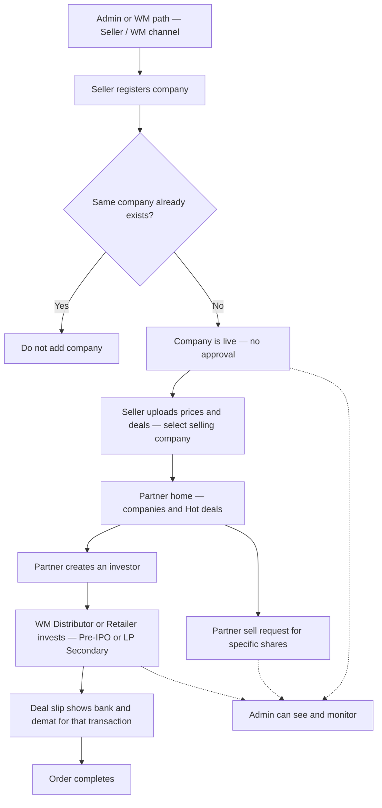

# Whole project flow — Partner marketplace

> **Stakeholders: start at [START-HERE.md](../START-HERE.md)** — one file with the full story and links to every child flow.  
> This page is the same journey in the workflows folder.

**Who this is for:** stakeholders, product, and business teams.  
**In one sentence:** A Seller adds companies, uploads **prices and deals** (selecting which company is selling, with bank/demat accounts); WM / Distributor / Retailer find **home** or **Hot deals**, create an investor and invest (**Pre-IPO / unlisted** or **LP Secondary** — same process) and get **bank + demat on the deal slip**; or raise a sell request.

> **Target model (docs):** Seller is a **partner role**. **Admin** can create **WM** or **Seller**. WM and Seller can have channel below; Seller has **no own investors**.  
> **Code later:** Today some seller features still use a separate seller account — this document describes the **intended** product flow.

---

## Big picture

**Admin note:** Admin can **see** companies and orders. This story is driven by **Seller** and **Partner**, not by admin approval of companies.

**Investor note:** In this product path, **only the Partner creates the investor** and places the investment for them.

**Company rules:**  
- **No approval** when Seller registers a company — it is live right away.  
- **Duplicate check** — if the same company already exists, do **not** add it again.

**Seller commercial rules:**  
- Same Seller uploads **prices**, **deals**, and related deals.  
- Seller can have **multiple companies selling shares** and **multiple bank / demat** accounts.  
- On deal create, Seller **must select the company selling the shares**.

**Partner actions:**  
- **WM / Distributor / Retailer** invest from **home** or **Hot deals** for **Pre-IPO / unlisted** or **LP Secondary** (same invest flow).  
- On invest, they receive that deal’s **bank and demat** on the **deal slip** (transaction level).  
- Or raise a **sell request** for **specific shares**.  
- **Seller** does not create investors or invest.

---

## Steps at a glance

| Step | What happens | Result | Detail |
|------|--------------|--------|--------|
| 1 | **Admin** creates WM and/or **Seller**; WM path + Seller path (Seller has Distributor/Retailer, **no** own investors; WM has own investors) | Network ready | [Flow A](flows/wm-create-seller-distributor.md) |
| 2 | Seller registers a company (with duplicate check) | New company is **live immediately**; if duplicate → not added | [Flow B](flows/seller-register-company.md) |
| 3 | *(No approval step)* | See Flow B / [Flow C note](flows/company-goes-live.md) | [Flow C](flows/company-goes-live.md) |
| 4 | Seller uploads prices & deals; selects **selling company**; uses bank/demat accounts | Deals ready; settlement details bound | [Flow D](flows/seller-prices-and-deals.md) |
| 5 | Partner browses **home companies** and **Hot deals** | Partner picks how to invest or sell | [Flow E](flows/partner-discovers-company.md) |
| 6 | **WM / Distributor / Retailer** creates an investor (not Seller) | Investor belongs to that partner | [Flow F](flows/partner-create-investor.md) |
| 7 | **WM / Distributor / Retailer** invests (home or Hot deals; **Pre-IPO** or **LP Secondary**) | Order placed; deal slip gets **bank + demat** | [Flow G](flows/partner-invest-for-investor.md) |
| 8 | Deal slip → payment → complete (transaction level) | Deal finished | [Flow H](flows/order-to-complete.md) |
| 9 | *(Branch)* Partner **sell request** for specific shares | Sell request recorded | [Flow I](flows/partner-sell-request.md) |

---

## How to use this with stakeholders

1. Show this page and the flowchart first (2–3 minutes).  
2. Click any step in the table for a deeper walkthrough.  
3. For roles (“who is who”), open the [Actors hub](../actors/README.md).

---

## Related

- [Actors hub](../actors/README.md) — roles in plain language  
- [Partner module](../modules/partner-business.md) — partner types and capabilities  
- [Partner database](../database/partner.md) — how roles connect in data  
- [Documentation index](../README.md)

---

## For technical team

- Living docs under `docs/`; code wins when behavior differs — update code later to remove approval gate and enforce duplicate-company validation on seller create.  
- Legacy path may still use `seller_master` + `/api/v2/seller` until migration.  
- Partner business APIs: `/api/v1/business`, `/api/v2/business`.  
- Pre-IPO order statuses and buy mechanics: [pre-ipo-buy-sell.md](pre-ipo-buy-sell.md), [features/pre-ipo.md](../features/pre-ipo.md).
