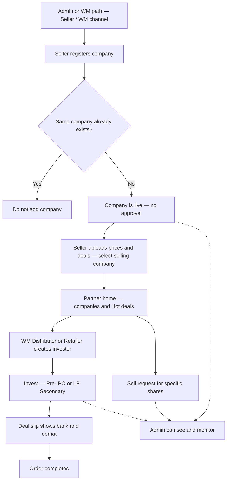

# Whole project flow — Partner marketplace

> **Stakeholders: start at [START-HERE.md](../START-HERE.md)** — one file with the full story (no step numbers) and links to every detail page.

**Who this is for:** stakeholders, product, and business teams.

**In one sentence:** Seller adds companies and deals; WM / Distributor / Retailer invest from home or Hot deals (Pre-IPO / unlisted or LP Secondary) and get bank + demat on the deal slip — or raise a sell request.

> **Target model:** Seller is a **partner role**. Admin creates **WM** or **Seller**. Seller has **no own investors**. Code later may still differ.

---

## Flowchart

---

## Story by topic (not numbered steps)

**Setup and hierarchy** — Admin creates WM and/or Seller; channel under WM or Seller.  
→ [Hierarchy](flows/wm-create-seller-distributor.md)

**Seller inventory** — Register company (live, no approval; block duplicates). Upload prices and deals; select selling company; bank/demat.  
→ [Register company](flows/seller-register-company.md) · [Prices and deals](flows/seller-prices-and-deals.md) · [Go-live note](flows/company-goes-live.md)

**Partner marketplace** — Home and Hot deals; create investor; invest (Pre-IPO / unlisted or LP Secondary); deal slip bank+demat; complete.  
→ [Home](flows/partner-discovers-company.md) · [Create investor](flows/partner-create-investor.md) · [Invest](flows/partner-invest-for-investor.md) · [Complete](flows/order-to-complete.md)

**Sell request** — Specific shares (separate from invest).  
→ [Sell request](flows/partner-sell-request.md)

---

## Rules

- Company: live on create, **no approval**; **no duplicate** companies.  
- Seller uploads prices and deals; multi companies; multi bank/demat; select selling company on deal.  
- WM / Distributor / Retailer invest; Seller does not.  
- Deal slip is **transaction-level** bank + demat.  
- LP Secondary uses the same invest process as Pre-IPO / unlisted.  
- Admin **sees/monitors**; does not gate company go-live.

---

## Related

- [START-HERE.md](../START-HERE.md)  
- [Actors hub](../actors/README.md)  
- [Partner module](../modules/partner-business.md)  
- [Partner database](../database/partner.md)  
- [Documentation index](../README.md)
